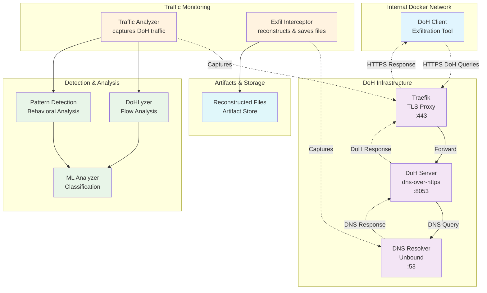

# DoHExfTlk: DNS-Over-HTTPS Exfiltration Toolkit

[](https://www.docker.com/)
[](https://python.org/)
[](#legal-disclaimer)

---

## ⚠️ Legal Disclaimer

> **EDUCATIONAL AND RESEARCH USE ONLY**  
> This toolkit is intended exclusively for:
> - Academic research
> - Cybersecurity training
> - Authorized testing in **controlled environments**
>
> **You agree to:**
>
> - Use this toolkit only on systems you own or have explicit written permission to test
> - Comply with all applicable laws and regulations
> - Accept full responsibility for your actions and their consequences  
>
> **The author disclaims any liability** for malicious, illegal, or unauthorized use.

---

## 📑 Table of Contents
- [Overview](#overview)
- [Research Context](#research-context)
- [System Architecture](#system-architecture)
- [Quick Start](#quick-start)
- [Main Components](#main-components)
- [Detection Features](#detection-features)
- [Machine Learning Workflow](#machine-learning-workflow)
- [Configuration Management](#configuration-management)
- [Security Considerations](#security-considerations)
- [Development & Contribution](#development--contribution)
- [Roadmap](#roadmap)
- [License & Citation](#license-and-citations)

---

## Overview

DoHExfTlk is a **research-oriented platform** for studying and detecting data exfiltration via **DNS-over-HTTPS (DoH)**.

It combines:

- **Network traffic capture**
- **Behavioral analysis**
- **Machine learning classification**
- **Data reconstruction**

**Use cases:**

- Academic research
- Cybersecurity training labs
- Benchmarking detection methods

---

## Research Context

DoHExfTlk is developed as part of an academic research project investigating the **detectability of data exfiltration over DNS-over-HTTPS (DoH)** in the presence of **evasion and adversarial strategies**.

This work is formally described in the following paper:

> **Evasion-Resilient Detection of DNS-over-HTTPS Data Exfiltration: A Practical Evaluation and Toolkit**  
> Adam Elaoumari  
> University of Kent – MSc Cyber Security  
> arXiv:2512.20423  
> https://arxiv.org/abs/2512.20423  
> https://doi.org/10.48550/arXiv.2512.20423  

## System Architecture


```mermaid
flowchart TB
    subgraph Internal[Internal Docker Network]
        Client[DoH Client<br/>Exfiltration Tool]
    end

    subgraph Infrastructure[DoH Infrastructure]
        Traefik[Traefik<br/>TLS Proxy<br/>:443]
        DoHServer[DoH Server<br/>dns-over-https<br/>:8053]
        Resolver[DNS Resolver<br/>Unbound<br/>:53]
    end

    subgraph Monitoring[Traffic Monitoring]
        TrafficAnalyzer[Traffic Analyzer<br/>captures DoH traffic]
        ExfilInterceptor[Exfil Interceptor<br/>reconstructs & saves files]
    end

    subgraph Analysis[Detection & Analysis]
        DoHLyzer[DoHLyzer<br/>Flow Analysis]
        MLAnalyzer[ML Analyzer<br/>Classification]
        PatternDetection[Pattern Detection<br/>Behavioral Analysis]
    end

    subgraph Artifacts[Artifacts & Storage]
        ArtifactStore[Reconstructed Files<br/>Artifact Store]
    end

    %% Main communication flow
    Client -.->|HTTPS DoH Queries| Traefik
    Traefik -->|Forward| DoHServer
    DoHServer -->|DNS Query| Resolver
    Resolver -.->|DNS Response| DoHServer
    DoHServer -.->|DoH Response| Traefik
    Traefik -.->|HTTPS Response| Client

    %% Monitoring connections
    TrafficAnalyzer -.->|Captures| Traefik
    ExfilInterceptor -.->|Captures| Resolver

    %% Analysis flow
    TrafficAnalyzer --> DoHLyzer
    TrafficAnalyzer --> PatternDetection
    DoHLyzer --> MLAnalyzer
    PatternDetection --> MLAnalyzer

    %% Exfil reconstruction (no analysis)
    ExfilInterceptor --> ArtifactStore

    %% Styling
    classDef client fill:#e1f5fe
    classDef infra fill:#f3e5f5
    classDef monitor fill:#fff3e0
    classDef analysis fill:#e8f5e8
    classDef storage fill:#e0f7fa

    class Client client
    class Traefik,DoHServer,Resolver infra
    class TrafficAnalyzer,ExfilInterceptor monitor
    class DoHLyzer,MLAnalyzer,PatternDetection analysis
    class ArtifactStore storage
```

---

## Quick Start

### Prerequisites
- **Docker** & **Docker Compose**
- Linux / macOS (or WSL2 for Windows)
- At least **4 GB RAM**
- **Python 3.12.3**
- **All exposed ports are accessible**

### ⚠️ Python packages

**Make sure to install all of the requirements.txt packages in python virtual environment.**

**Make sure to activate the virtual environment before running any Python scripts.**

**When you are in any directory that uses Python scripts and you want to run a script outside of a container, make sure to activate the virtual environment first and check that the packages are installed.**

**In case of error make sure you are using the same Python version as specified in the Prerequisites section as this toolkit has NOT been tested with other versions.**


### Installation
```bash
# 1. Clone repository
git clone git@github.com:AdamLBS/DohExfTlk.git
cd DohExfTlk

# 2. Download the dataset's CSVs used for the model training (l1-benign.csv & l2-malicious.csv)
wget http://cicresearch.ca/CICDataset/DoHBrw-2020/Dataset/CSVs/Total_CSVs.zip
unzip Total_CSVs.zip
mkdir -p datasets
cp l2-benign.csv l2-malicious.csv datasets/

# 2. Generate TLS certificates
chmod +x generate_certs.sh
./generate_certs.sh

# 3. Start infrastructure
docker compose build
docker compose up -d
```

### Verification
```bash
# Check running services
docker compose ps

# Test DoH server
docker exec -it client_test bash /scripts/test_doh.sh
```

### Launch a full exfiltration scenario

```bash
# Train model
cd ml_analyzer
# python3 can be used if python is not found
python -m venv .venv
source .venv/bin/activate
pip install -r requirements.txt
python model_trainer.py
# Wait for training to be finished

# Launch the pipeline

cd DoHExfTlk/exfiltration/client
bash run_pipeline.sh
```

---

## Main Components

### DoH Infrastructure
- **DoH Server** with TLS
- **DNS Resolver** (Unbound)
- **TLS Proxy** (Traefik)

### Detection & Analysis
- **Traffic Analyzer** (pcap capture + flow extraction)
- **Exfiltration Server** (pattern detection + data reconstruction)
- **DoHLyzer** (behavioral analysis)
- **ML Analyzer** (model training & prediction)

### Clients & Testing
- **Configuration Generator** (`config_generator.py`)
- **Exfiltration Client** (encoding + evasion techniques)
- **Predefined Test Scenarios**
- **Automated Test Scripts**

---

## Detection Features

### Traditional Detection
- **Pattern analysis**: suspicious DNS label structures
- **Temporal analysis**: irregular timing patterns
- **Content analysis**: encoded payload detection

---

## Machine Learning Workflow

### Training Phase
```bash
cd ml_analyzer
python3 model_trainer.py --quick --fpr 0.01
# Models saved in /models/
```

### Detection & Classification Phase
Theses commands are automatically executed by the pipeline, but can be used manually if needed.
```bash
# 1. Analyze traffic with DoHLyzer
# 2. Filter detected queries
cd exfiltration/client
./filter_detection_csv.sh

# 3. Classify with trained models
cd ../../ml_analyzer
python3 predict.py ../traffic_analyzer/output/filtered_output.csv
```

**ML pipeline goal:** confirm whether detected flows are malicious or benign.

---

## Configuration Management

### Create or Manage Configurations
```bash
cd exfiltration/client

# Create interactively
python config_generator.py --create

# List available
python config_generator.py --list

```

**Example Configuration (APT Simulation)**:
```json
{
  "name": "APT Simulation",
  "description": "APT Simulation",
  "exfiltration_config": {
    "doh_server": "https://doh.local/dns-query",
    "target_domain": "exfill.local",
    "chunk_size": 8,
    "encoding": "base32",
    "timing_pattern": "random",
    "base_delay": 30.0,
    "delay_variance": 15.0,
    "compression": true,
    "encryption": false,
    "subdomain_randomization": false,
    "domain_rotation": false,
    "padding": true,
    "padding_size": 20
  },
  "notes": "APT Simulation"
}
```

---

## Security Considerations
- Run **only** in isolated lab environments (as this code uses insecure Docker feature and exposes the host's Docker socket to some containers)
- Never connect to production networks
- Use VM snapshots or containers for quick reset
- Ensure **all participants** have legal authorization

---

## Development & Contribution

**Code Structure**
```
├── exfiltration/      # DoH exfiltration Clients & servers
├── ml_analyzer/       # ML training & prediction
├── traffic_analyzer/  # DoH Traffic analysis
├── datasets/          # Training datasets
└── docs/              # Documentation
└── models/            # Trained ML models
└── client_scripts/    # Scripts that can be ran in the client container
└── datasets/          # Dataset files for training
```

---
## Video examples

**File exfiltration example**
In this example, we are exfiltrating a txt file via the exfiltration client, and showing that it has been captured by the exfil_interceptor server.


https://github.com/user-attachments/assets/6a6a31ec-4718-4319-ba39-d3d5832c2007


**Pipeline Test Example**

In this example, we are testing the entire exfiltration pipeline, from the client to the server, that tests multiple configurations and use the predictor to see if the flows have been marked as malicious.
It then shows an overall ranking of all the configurations


https://github.com/user-attachments/assets/1dff6d15-bca4-4ec7-993e-c1555ff9657c


---

## Roadmap

**v1.0**
- Complete DoH infra
- Pattern detection
- Basic ML models
- Data reconstruction

**Future**
- Real-time detection
- Deep learning
- Web monitoring dashboard
- REST API integration

---

## Open Source Projects used
[DoHLyzer](https://github.com/AdamLBS/DoHLyzer) forked by Adam Elaoumari, here are the modifications made :
- Added multithreading for the Garbage Collector used to create the flows
- Changed thresholds to write flows in the CSV files (this fixes an issue where small DNS exfiltration were not acknowledged)
- Fixed compatibility issues with the latest Python version (3.10+)

[DoHBrw-2020-Dataset](https://www.unb.ca/cic/datasets/dohbrw-2020.html) is used for training and testing the machine learning models.

[DoHXp](https://ieeexplore.ieee.org/document/9844067) by J. Steadman and S. Scott-Hayward


## License and Citations

If used in academic work, please cite:
```bibtex
@misc{DoHExfTlk,
  title={DNS-Over-HTTPS Exfiltration and Evasion Toolkit},
  author={Adam Elaoumari},
  year={2025},
  institution={University of Kent - Canterbury},
  note={MSc Cyber Security Dissertation Project}
}
```


---

